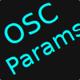
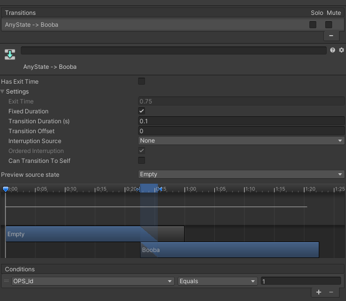
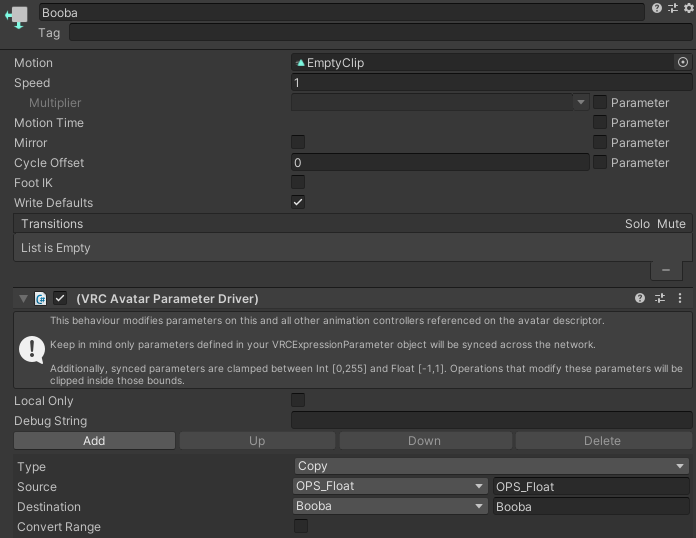

# OSC-Params-Sync

I've provided it as is and with no warranty of any kind.

## Credit

Original Script by JayJay provided by Fuujin with the Fuujin's Gumroad page [https://fuuujin.gumroad.com/l/OSCParameterSync](https://fuuujin.gumroad.com/l/OSCParameterSync)

## Help Section

config.json

```
{
    "serverPort": 9001,
    "serverIp": "127.0.0.1",
    "clientPort": 9000,
    "clientIp": "127.0.0.1",
    "packetDelay": 0.2,
    "debugMode": false,
    "switchPacketOrder": false
}
```
Client IP is the computer VRChat is running on in most cases should be 127.0.0.1 or localhost.

If your avatar sometimes would input the wrong data into the you params, you can try switching the packet order or increase the packetDelay.

Example transition settings


Example animation settings


## Installation
The Program can be run using the included binary in the Releases area.

Requires Python 3 to be installed and in path.

Requires Libary Python-OSC
Install command
```
pip install python-osc
```

Run using command prompt in directory
```
Python3 osc-params-sync.py
```

## Troubleshooting
If OSC Params Sync is logging Avatar Id changes when you change avatars but doesn't show any changes when you change values within VRC, reset your OSC config for your avatar. If that doesn't work, delete the avatarid.json in `%appdata%\..\LocalLow\VRChat\VRChat\OSC`->usr_hash\Avatars\avtr_hash.json. Then turn off and on OSC within VRC to have it regenerate the config for your avi.

If that doesn't work, check if you have any scramblers on your avatar that affecting your parameters, or if you named them incorrectly in your parameters.
